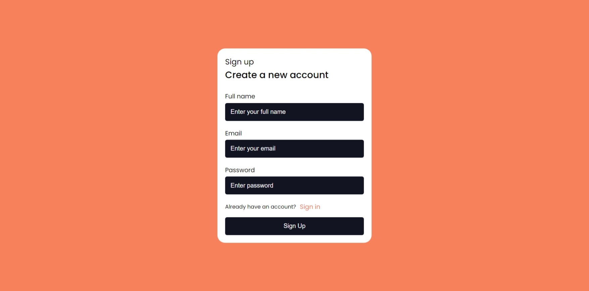
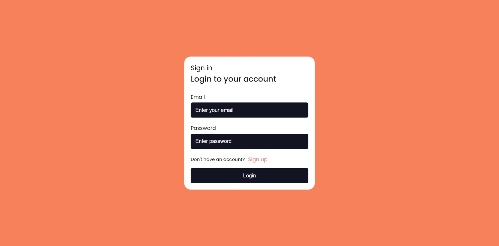
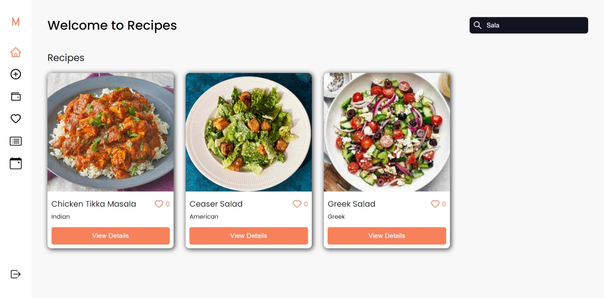
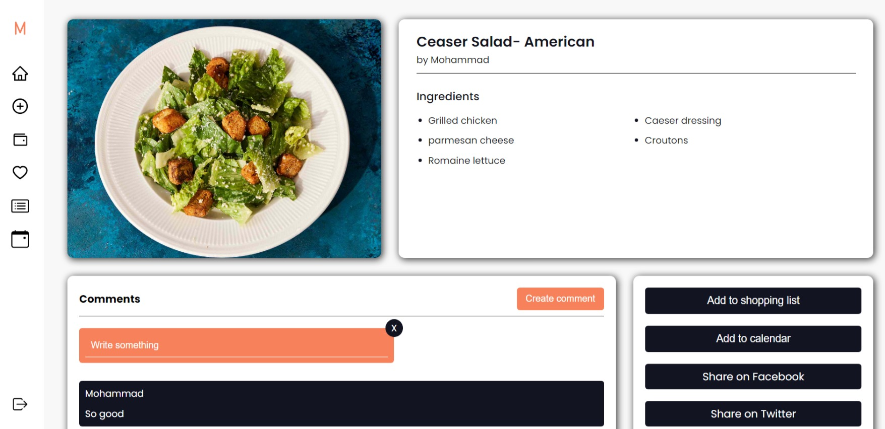
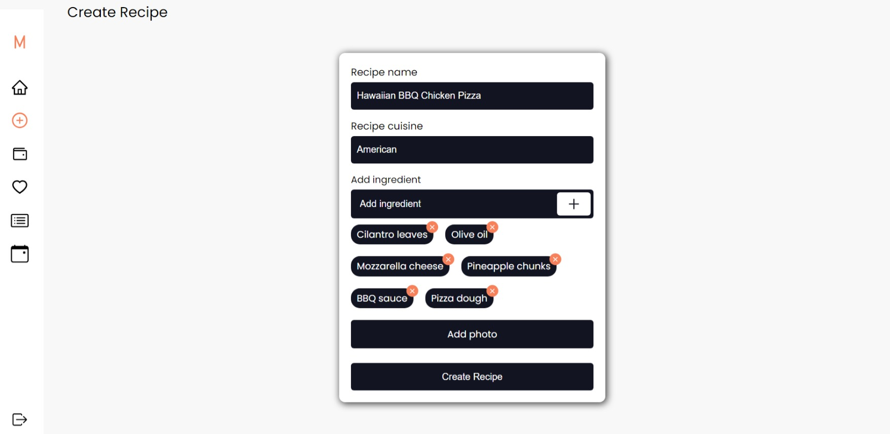

- [Project Philosophy](#project-description)
  - [User stories](#user-stories)
- [Demo](#demo)
- [Tech Stack](#tech-stack)
- [How to Run](#how-to-run)
  - [Prerequisites](#prerequisites)
  - [Installation](#installation)

<br><br>

<!-- project philosophy -->
<a name="project-description"></a>


> RecipeHub is a place where food lovers can find and share recipes, connect with others who enjoy cooking, and plan meals. Whether you're searching for new dishes, sharing your own recipes, or organizing your weekly meals, RecipeHub is here for you. It's a user-friendly platform to explore, create, and savor delicious recipes.

<a name="user-stories"></a>
### User Stories
- As a user, I want to sign up and log in so that I can access my account.
- As a user, I want to share recipes so that I can contribute my favorite dishes to the community.
- As a user, I want to discover recipes by searching so that I can find new and exciting meal ideas.
- As a user, I want to like recipes so that I can show my appreciation for dishes I enjoy.
- As a user, I want to comment on recipes so that I can share my thoughts and ideas with other users.
- As a user, I want to share recipes on social media so that I can inspire others to try new recipes.
- As a user, I want to create shopping lists so that I can easily manage my grocery shopping for planned meals.

<br><br>

<!-- Demo -->
<a name="demo"></a>


| Signup  | Login | Browse Recipes |
| ---| ---| ---|
|  |  |  |
###
| Recipe Details  | Create Recipes |  |
| ---| ---| ---|
|  |  |  |

<br><br>

<!-- Tech stack -->
<a name="tech-stack"></a>


###  RecipeHub is built using the following technologies:
- React: The frontend is developed with React, providing an intuitive and user-friendly interface.
- Laravel: The backend is powered by Laravel, a PHP web application framework, handling user authentication, recipe management, and interactions.
- MySQL: MySQL serves as the relational database to store user information, recipe data, comments, and more.

<br><br>

<!-- How to run -->
<a name="how-to-run"></a>


> To set up Online Recipes locally, follow these steps:

### Prerequisites
<a name="prerequisites"></a>

* npm
  ```sh
  npm install npm@latest -g
  ```

### Installation
<a name="installation"></a>

1. Ensure you have Node.js installed. We recommend using the latest version available.
2. Clone the repo
   ```sh
   git clone https://github.com/mhmdhussein377/Online-Recipe-website-React-Laravel.git
   ```
3. Navigate to

   ```sh
   cd Online-Recipe-website-React-Laravel/Backend
   ```
4. Run composer install
   
   ```sh
   composer install
   ```
5. Initialize the database
   
   ```sh
   php artisan migrate
   ```
6. Serve to start the server
    
   ```sh
   php artisan serve
   ```
7. Install NPM packages
   ```sh
   cd client
   ```
   ```sh
   npm install
   ```
8. Run the project
   ```sh
   cd client
   ```
   ```sh
   npm run dev
   ```

Now, you should be able to run Online Recipes locally and explore its features.
